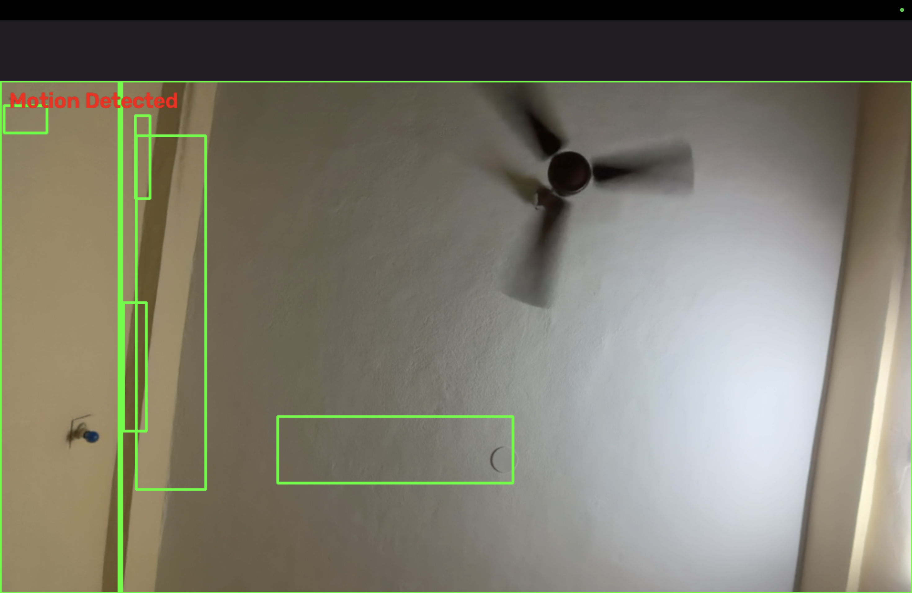

# OpenCV Motion Detection

A simple real-time motion detection system using **Python, OpenCV, and a webcam**.

## 📌 Project Overview

This project detects movement from a live webcam feed by comparing the current video frame with a reference frame.

When significant movement is detected, the moving area is highlighted with a green rectangle and the status changes to **Motion Detected**.

## ✨ Features

* 🎥 Real-time webcam monitoring
* 🔍 Motion detection using frame difference
* 🖼️ Grayscale image processing
* 🌫️ Gaussian Blur for noise reduction
* 📦 Contour-based motion detection
* 🟩 Bounding box around detected movement
* ⚡ Simple and lightweight implementation

## 🛠️ Technologies Used

* Python
* OpenCV
* Imutils

## ⚙️ How It Works

```text
Webcam
   ↓
Capture Frame
   ↓
Convert to Grayscale
   ↓
Gaussian Blur
   ↓
Compare with Reference Frame
   ↓
Thresholding
   ↓
Contour Detection
   ↓
Motion Detected
```

## 🚀 Installation

Clone the repository:

```bash
git clone https://github.com/harini020306/motion_detector_openCV.git
cd motion_detector_openCV
```

Install the required libraries:

```bash
pip install -r requirements.txt
```

## ▶️ Run the Project

```bash
python motion_detector_OpenCV.py
```

The webcam will open automatically.

* **Normal** → No significant movement detected
* **Motion Detected** → Movement detected

Press **Q** to exit the application.

## 📷 Output

Add a screenshot of the webcam output here:

```text

```

## 🔮 Future Improvements

* Save images when motion is detected
* Add motion detection alerts
* Add email notifications
* Detect and track multiple objects
* Integrate AI-based person detection

## 👩‍💻 Author

**Harini K**
